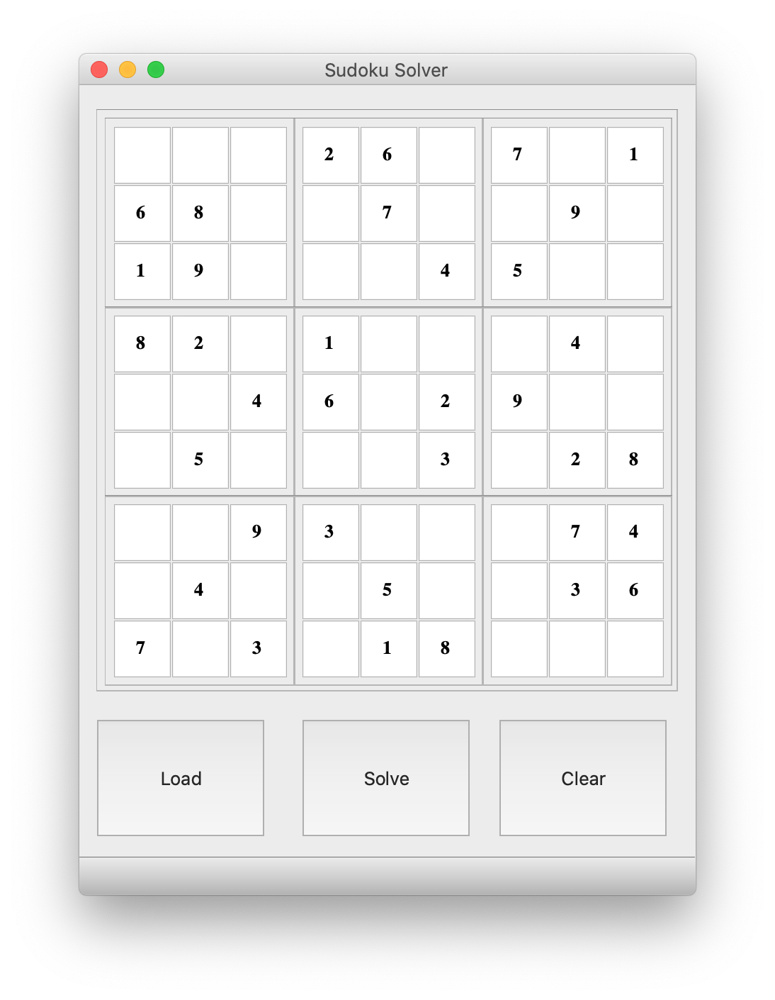
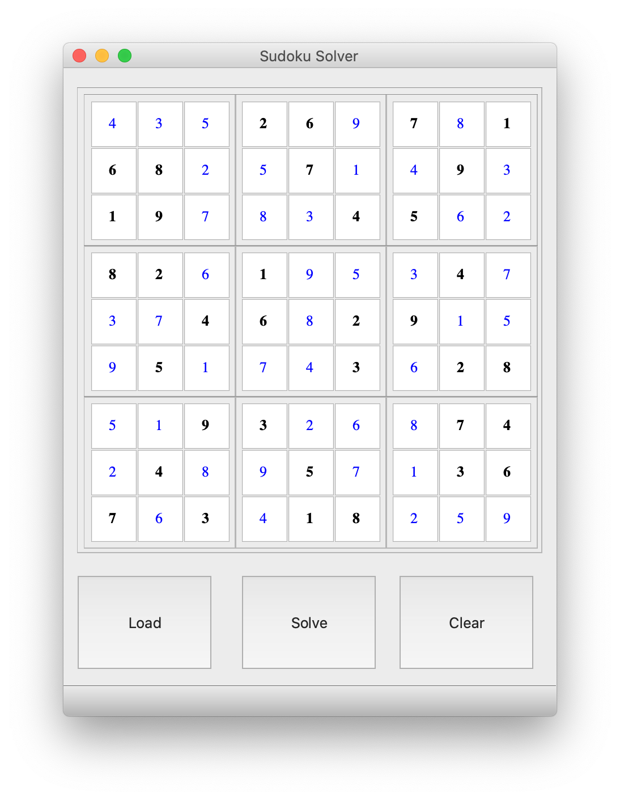

# Sudoku Solver Using Python & PyQt5.




## This is a Sudoku bord Solver.

#### The modules Used to make this script are:-

        -PyQt5
        -sys
        -threading
        -pathlib
        -time

This is a GUI based python script.

## Install
```
- Download this repository on local machine.
- Extract SudokuSolver repository on local machine and open SudokuSolver folder

```

Python Code On windows machine:

clone SudokuSolver.py repository on local machine.
```

> git clone https://github.com/geosaleh/SudokuSolver

```
change directory to SudokuSolver
```

> cd SudokuSolver/

```

Now its time to execute **tic_tac_toe.py**
```

> python SudokuSolver.py

```
it will show following Output


## Download
:paperclip: [Download Here](https://github.com/geosaleh/SudokuSolver)

Hope you'll install it in your computer just to try .


```
